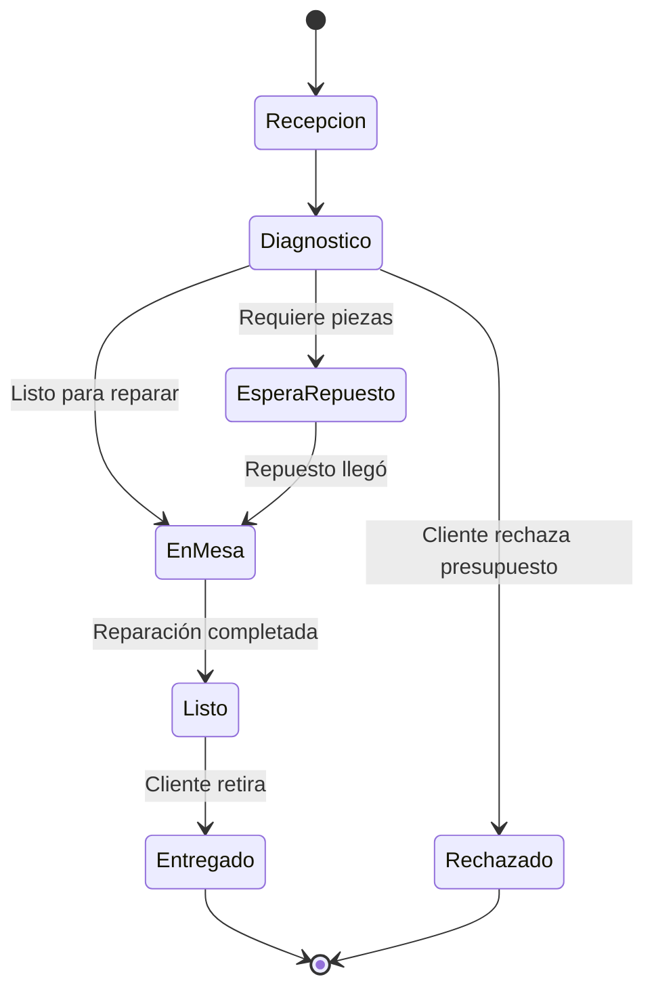

# 🔧 SAT Logic Engine (Cerebro de Reparaciones)

## Propósito
Gestionar el ciclo de vida completo de un dispositivo en el taller de reparación Smart Point.

---

## 1. Estados del Ticket de Reparación



### Definición de Estados
```typescript
// types/sat.ts
type TicketStatus = 
  | 'recepcion'      // Equipo ingresado, pendiente diagnóstico
  | 'diagnostico'    // Técnico evaluando falla
  | 'espera_repuesto'// Aguardando pieza de inventario/proveedor
  | 'en_mesa'        // En reparación activa
  | 'listo'          // Reparado, esperando retiro
  | 'entregado'      // Cliente retiró el equipo
  | 'rechazado';     // Cliente rechazó presupuesto

interface TicketReparacion {
  id: string;
  cliente_id: string;
  dispositivo: {
    marca: string;
    modelo: string;
    imei?: string;
    patron_desbloqueo_encrypted?: string; // AES-256
    color?: string;
  };
  falla_reportada: string;
  diagnostico?: string;
  presupuesto?: number;
  estado: TicketStatus;
  fotos_ingreso: string[]; // URLs de Supabase Storage
  firma_cliente?: string;  // Base64 de firma digital
  tecnico_asignado?: string;
  fecha_ingreso: Date;
  fecha_actualizacion: Date;
  fecha_entrega?: Date;
  prioridad: 'normal' | 'urgente';
}
```

---

## 2. Automatizaciones por Estado

### Webhook WhatsApp Business
Cuando el estado cambia a `listo`:

```typescript
// lib/sat/notifications.ts
async function notifyClientReady(ticket: TicketReparacion) {
  const message = `
🔔 *Smart Point Maldonado*

¡Hola! Tu ${ticket.dispositivo.marca} ${ticket.dispositivo.modelo} está *LISTO* para retirar.

📍 Estamos en Av. Roosevelt, Parada 10
⏰ Horario: Lun-Sáb 10:00 a 20:00

Ticket: #${ticket.id.slice(0, 8).toUpperCase()}

¿Necesitás coordinar horario? Respondé este mensaje.
  `.trim();

  await sendWhatsAppTemplate(ticket.cliente_id, 'repair_ready', {
    device: `${ticket.dispositivo.marca} ${ticket.dispositivo.modelo}`,
    ticketId: ticket.id.slice(0, 8).toUpperCase()
  });
}
```

### Flujo de Estados y Acciones
| Estado Anterior | Estado Nuevo | Acción Automática |
|-----------------|--------------|-------------------|
| recepcion | diagnostico | Asignar técnico disponible |
| diagnostico | espera_repuesto | Crear orden de compra |
| en_mesa | listo | **WhatsApp: Equipo listo** |
| listo | entregado | Solicitar review en Google |

---

## 3. 🚨 Agente de Emergencia: Celular Mojado

### Detección
Si el cliente reporta palabras clave:
- "mojado", "agua", "lluvia", "piscina", "mar"
- "no prende", "pantalla negra" + contexto húmedo

### Flujo UI Prioritario
```typescript
// components/emergency/WaterDamageFlow.tsx
const WATER_DAMAGE_INSTRUCTIONS = [
  {
    icon: '🔌',
    title: 'NO CARGUES el dispositivo',
    description: 'Conectar el cargador puede causar cortocircuito irreversible'
  },
  {
    icon: '📴',
    title: 'Apagalo si aún prende',
    description: 'Mantené presionado el botón de encendido'
  },
  {
    icon: '🌾',
    title: 'NO uses arroz',
    description: 'Es un mito. El arroz no ayuda y puede dejar residuos'
  },
  {
    icon: '⚡',
    title: 'Traelo URGENTE',
    description: 'Las primeras 24hs son críticas para salvarlo'
  }
];
```

### Reserva de Turno Urgente
- Mostrar slots disponibles HOY
- Prioridad: `urgente`
- Descuento automático si trae el equipo en <2 horas
- SMS de confirmación inmediato

---

## 4. Seguridad de Datos

### Encriptación de Patrón de Desbloqueo
```typescript
// lib/encryption/device-secrets.ts
import { createCipheriv, createDecipheriv } from 'crypto';

const ALGORITHM = 'aes-256-gcm';
const SECRET_KEY = process.env.DEVICE_ENCRYPTION_KEY!;

export function encryptPattern(pattern: string): string {
  // Solo almacenar si el cliente da consentimiento explícito
  // Eliminar automáticamente al entregar el equipo
}

export function decryptPattern(encrypted: string): string {
  // Solo accesible por técnicos autorizados
  // Log de cada acceso en audit trail
}
```

---

## 5. Integraciones SAT

### Inventario Automático
- Al crear ticket con falla conocida, verificar stock de repuesto
- Si stock < umbral crítico, crear alerta para compras

### Venta Cruzada
- Al completar reparación de iPhone 13, sugerir:
  - Funda compatible
  - Vidrio templado
  - Cargador original
